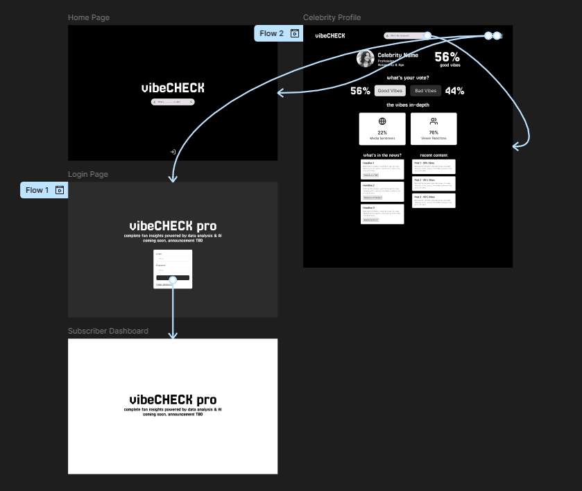
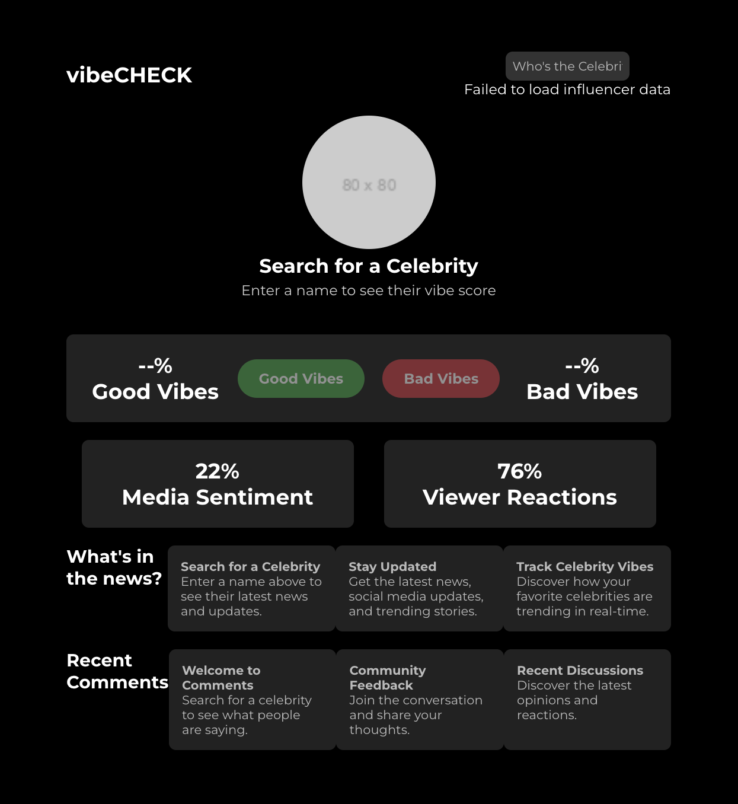

# vibeCHECK Frontend

VibeCHECK is a web-based application that allows users to analyze influencer behavior and public sentiment. Users can view recent content related to influencers, such as YouTube videos and comments along with TMZ articles, and vote whether the influencer's vibe is 'good' or 'bad.' The system analyzes scraped data from YouTube and stores it in a MySQL database. We conduct sentiment analysis on both recent comments and articles about each celebrity to get a media opinion factor. Our proprietary VibeScore algorithm then aggregates the media sentiment with the voting to create a single vibe score ranging from 0 to 100 that encapsulates the influencers "vibe".

## Project Overview
The platform empowers users to explore celebrity profiles through an intuitive interface that combines real-time sentiment analysis with community participation. Users can access current news coverage, track sentiment trends through our proprietary VibeScore system, and contribute their own perspectives through a streamlined voting mechanism.

## Features

### Profile Analysis
Our sentiment tracking system provides continuous monitoring of celebrity profiles through multiple data points. The platform aggregates news sentiment scores on a 1-10 scale, processes community voting patterns, and generates historical trend analysis. This multi-faceted approach ensures comprehensive coverage of public perception.

### Data Visualization
The platform features sophisticated data visualization tools, including the VibeChart system that tracks historical sentiment trends. Our color-coded sentiment indicators provide immediate visual feedback, with green representing positive sentiment (8-10), yellow indicating neutral coverage (5-7), and red highlighting negative sentiment (1-4). Progress bars display real-time vote distributions, offering instant community feedback.

### News Integration
The news integration system curates the five most recent articles for each celebrity profile. Each article undergoes automated sentiment analysis, receiving a score that reflects its emotional tone. Users can access original sources through direct links while viewing our sentiment analysis overlay.

## Design Reference

We started our planning process on Figma by designing a complete wireframe of what we expect the public user facing experience to look like. This mainly consists of the home page and the celebrity profile page. The Enterprise login flow was developed but we have yet to visualize the final dashboard for our celebrity clients.
The application's design is based on [this Figma wireframe](https://www.figma.com/design/tnI1ROfsFqTrYPKUdABruG/vibeCheck?node-id=4-99&t=WS81IPDE2VkEVD72-1), which outlines our final envisioned user experience.
- We have only built out the Celebrity Profile page from this wireframe but we expect to implement the full experience at completion.



Versus our Current React Prototype



## Technical Architecture

### Component Structure
The application utilizes a modular architecture with specialized components handling distinct functionalities. The App.js component manages global state and routing, while Profile.js coordinates data flow between specialized modules. VoteSection.js handles community interaction, and VibeChart.js provides data visualization services.

Under the guidance from the assignment instructions, we split the functionality of the profile page between multiple components that each provide a certain feature for the celebrity profile page.

This development was heavily assisted with Claude 3.5 Sonnett. Human debugging was required although there may be some efficiencies/redundant/messy code we aim to clean up on final release.

### App.js
The main application container that:
- Manages global state
- Handles routing and component composition
- Coordinates data flow between components
- Maintains the overall layout and structure

### SearchBar.js
A search component that:
- Fetches celebrity data from the API
- Provides real-time search functionality
- Returns matched celebrity information
- Handles error states and loading conditions

### NewsSection.js
Displays recent news and updates:
- Fetches content from the API's /content endpoint
- Filters content by celebrity ID
- Shows the three most recent news items
- Provides placeholder content when needed

### RecentContent.js
Manages user comments and interactions:
- Pulls data from the API's /comments endpoint
- Displays recent community feedback
- Filters comments by celebrity ID
- Shows placeholder content when no data is available

### VoteSection.js
Handles user voting functionality:
- Displays current vibe scores
- Manages voting buttons
- Shows good/bad vibe percentages
- Integrates with the API for vote submission

### VibeChart.js
Provides the historical chart of VibeScore fluctuations
- Uses built in React effects without installing new pacakges

This has yet to be fully built out as it will require us to perform push calls to our API which is not fully set up yet. This will be completed by the final release.

## Installation and Setup

1. Clone the repository:
```bash
git clone https://github.com/ichen888/vibeCHECK-frontend.git
cd vibeCHECK-frontend
```

2. Install dependencies:
```bash
npm install
```

3. Create a `.env` file in the root directory:
```
REACT_APP_API_URL=http://localhost:8000
```

4. Start the development server:
```bash
npm start
```

5. Open [http://localhost:3000](http://localhost:3000) to view it in your browser.

## Dependencies

- React 18.x
- React Router 6.x
- Other dependencies can be found in package.json

## Backend Integration

This frontend application integrates with the [vibeCHECK Backend](https://github.com/Kyrie21323/FinalProject), which provides:
- Celebrity data management
- Sentiment analysis
- Content aggregation
- User interaction handling

Ensure the backend server is running before starting the frontend application.

## Deployment

The application employs Docker containerization for consistent deployment across environments. Our Google Cloud Platform integration ensures reliable scaling and global accessibility through Cloud Run's serverless architecture. Continuous integration and deployment are managed through Cloud Build, maintaining consistent update cycles.

The live application can be accessed at: https://vibecheck-frontend-57495040685.us-central1.run.app/

The live backend server is hosted at: https://vibecheck-backend-57495040685.us-central1.run.app/

## Future Development

Our development roadmap includes enhanced data visualization capabilities, advanced sentiment analysis algorithms, and improved mobile responsiveness. We plan to implement user preference systems, expand our historical data analysis tools, and introduce interactive chart features for deeper insight into sentiment trends.

## License

This project is licensed under the MIT License - see the LICENSE file for details.

## Acknowledgments

- Backend development by our team here (https://github.com/Kyrie21323/FinalProject)
- UI/UX design reference from Figma
- React.js community and documentation

## Contributors

The front end was designed & built by Ian Chen and Jessica Yu, with additional support from Kyrie Park and Harsh Sahu, the primary backend developers.

For more information about the backend implementation, visit the [Backend Repository](https://github.com/Kyrie21323/FinalProject).
